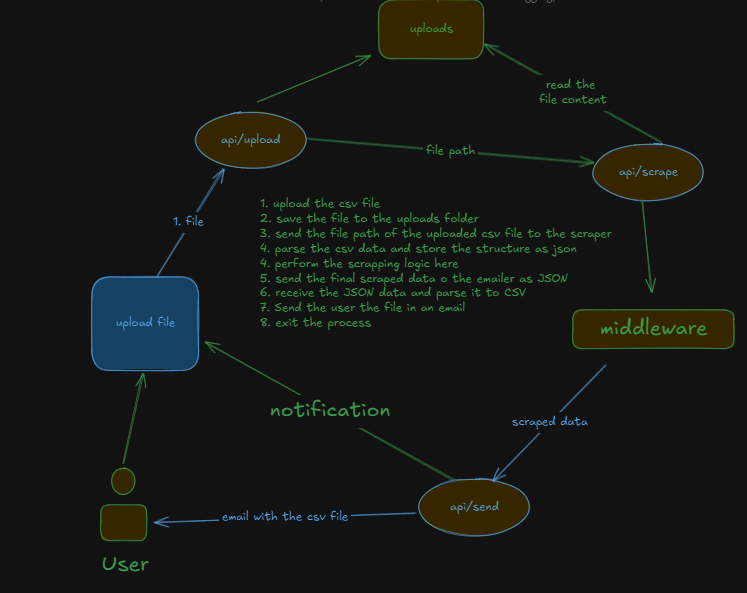

## Steps to get this app up and running
1. Extract the folder and run this command to install the neccassary packages
```bash
pnpm install
```
2. Run this command to initialize a new git repository
```bash
git init && git remote add origin <your_github_repo>
```
3. Go to vercel.com and import this project from github
4. Under the environment variables put **RESEND_API_KEY** and **SCRAPE_DOT_DO_API_TOKEN** alongside their values
5. deploy it! 

### To understand the architecture of the app refer the architecture image

